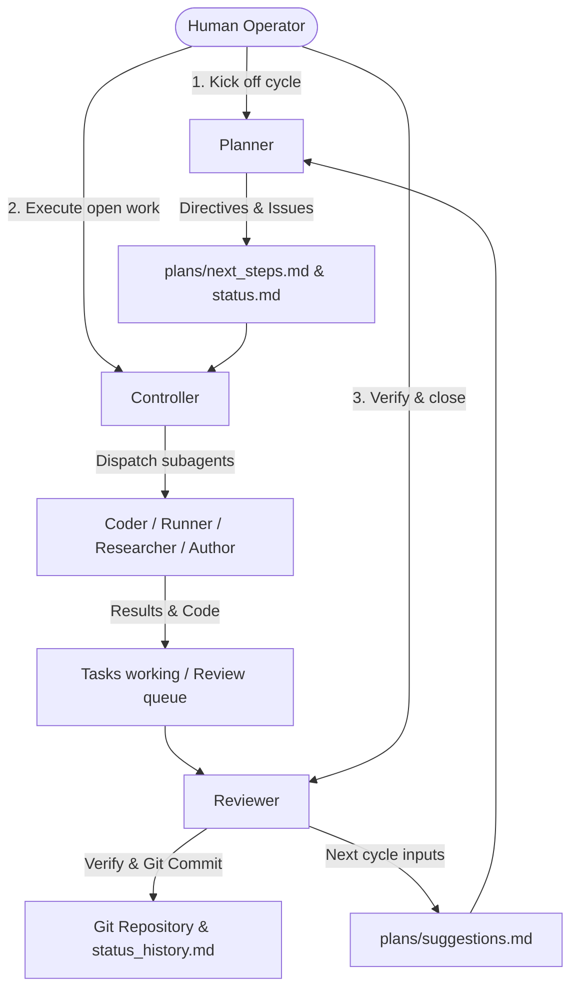
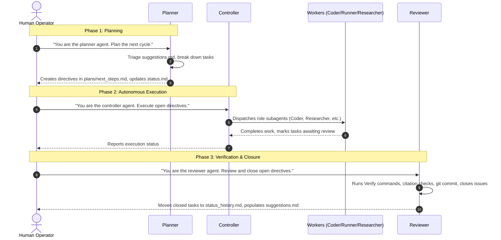

# Multi-Agent Harness — User Guide & Operator Manual

This is the operator manual for a `friday` multi-agent harness. It's the
same file for every project using this harness — this repo owns it, and
consumer projects symlink it in (`harness/USER_GUIDE.md` → `.friday/USER_GUIDE.md`),
so it never drifts out of date and updates the moment friday syncs. It
explains how the harness is organized, how to operate it through the
**Planner → Controller → Reviewer** workflow, where to monitor progress, and
how to provide inputs to the agents.

Project-specific facts (this project's name, working root, results doc,
package manager, task tracker, repository layout) live in `AGENTS.md` at
the consumer project's root — that's the one file every session loads, and
the only place per-project answers are recorded. This guide never needs
project-specific values; if you find yourself wanting to write one in here,
it belongs in `AGENTS.md` instead.

**Setting up or reconfiguring the harness itself** (package manager
changed, added a task tracker, want Docker or GPU support now) is a
separate flow from day-to-day operation: point an agent at
`.friday/setup/SETUP.md` and ask it to walk you through setup — see that
file for the full interview, and friday's own `README.md` for the
first-time drop-in steps and how to pull harness updates into this project.

---

## 1. Harness Overview & Philosophy

The harness is a structured multi-agent workflow framework designed for
complex, long-running research and engineering projects. It enables
multiple AI sessions (and different AI models) to collaborate across hours
or weeks without losing state, drifting from requirements, or fabricating
progress.

### Core Problems Solved

1. **Context Amnesia & Drift**: Standard chat sessions forget past architectural decisions and re-derive context from scratch. The harness uses living directive files (`plans/directives/`), structured handoffs, and durable history logs to maintain continuity across sessions.
2. **Fabricated Progress & Hallucinated Results**: Agents can prematurely declare a task "done" without executing tests. The harness enforces explicit `Verify:` commands, provenance sidecars, and an independent **Reviewer** gate that verifies outputs before recording work.
3. **Unrecorded or Blended Work**: In multi-agent environments, code changes can become entangled. The harness enforces role-attributed git commits (`Role: <description>`) with commit hashes recorded directly in `tasks_finished.md` and `status_history.md`.
4. **Token & Cost Efficiency**: Rather than loading the entire project history into every session, files follow strict line caps (Rule 8), and agents only load detail docs when specific triggers match.



---

## 2. The Operator Workflow: Planner → Controller → Reviewer

As a human operator, you do **not** need to micromanage individual implementation agents (Coder, Runner, Researcher, Author). Instead, you interact with the system via three high-level roles:

1. **Planner**: Breaks high-level goals into concrete, verified work specifications (directives).
2. **Controller**: Dispatches and monitors autonomous executor agents to do the work.
3. **Reviewer**: Independently verifies outputs, records commits, and closes work.



---

### Step 1: The Planner Pass (Kick Off a Cycle)

When starting a new phase, addressing blockers, or planning the next milestone:

1. **Prompt the agent**:
   ```
   You are the planner agent. Triage suggestions.md and create directives for the next cycle.
   ```
2. **What the Planner does**:
   - Reads `harness/plans/suggestions.md` to see what previous Reviewer passes or human operators flagged.
   - Formulates concrete directives in `harness/plans/next_steps.md` and detailed specifications in `harness/plans/directives/<ID>.md`.
   - Assigns each directive:
     - A **tier tag**: `[light]` (standard model) or `[heavy]` (high-tier model for formal derivations or major architecture calls).
     - A **`Verify:` line**: An explicit shell command or concrete judgment criterion that will prove completion.
     - A tracking issue in this project's task tracker, if one is configured (Rule 13 — see `AGENTS.md` for whether this project uses one).
     - A registered row in `harness/status.md` (State: `queued` or `blocked`).

---

### Step 2: The Controller Pass (Autonomous Execution)

Once directives are defined in `harness/plans/next_steps.md`:

1. **Prompt the agent**:
   ```
   You are the controller agent. Execute the open directives in harness/plans/next_steps.md.
   ```
2. **What the Controller does**:
   - Inspects `harness/status.md` and `harness/plans/next_steps.md`.
   - Dispatches specialized subagents (Coder, Runner, Researcher, Author) using formatted spawn titles: `role(model): task`.
   - Enforces tier escalation (e.g., routing `[heavy]` tasks to high-tier models).
   - Monitors background tasks and detached long-running jobs (Rule 15).
   - Relays any real-time user steering via `User-Feedback:` tags.
   - Advances directive states in `harness/status.md` from `queued` → `in progress` → `awaiting review`.
3. **Why you don't need to run Coder/Runner directly**:
   - The Controller enforces role boundaries and coordinates parallel work without executing mutations directly.

---

### Step 3: The Reviewer Pass (Verification & Closure)

When tasks reach `awaiting review`:

1. **Prompt the agent**:
   ```
   You are the reviewer agent. Review open directives, verify outputs, and close completed work.
   ```
2. **What the Reviewer does**:
   - **Independent verification**: Executes the exact command specified on each directive's `Verify:` line.
   - **Mechanical validation** (paths under `harness/tools/` and the adapter's `hooks/` directory — see `harness/tools/README.md`-equivalent below for the full list):
     - Verifies reference existence and DOIs: `python3 harness/tools/verify_references.py`
     - Lints research memo formatting: `python3 harness/tools/lint_research_memo.py`
     - Checks against unavailable sources: `python3 harness/tools/check_unavailable_sources.py`
     - Checks markdown line caps: `python3 .claude/hooks/check_md_hygiene.py` (or `.agents/hooks/check_md_hygiene.py`, whichever adapter(s) this project uses)
   - **Git commit & attribution** (Rule 12): Commits verified changes under a message attributed to the role (e.g., `Coder: implement JAX particle filter update step`).
   - **Issue closure** (Rule 13): Closes the associated tracker issue, if this project uses one.
   - **Status archival** (Rule 3): Removes the closed directive from `harness/status.md` and appends its permanent record to `harness/status_history.md`.
   - **Feedback loop**: Writes any follow-up recommendations or new research needs into `harness/plans/suggestions.md` to feed the next Planner pass.

---

## 3. Information Architecture: Where to View Status & Plans

| What are you looking for? | Where it lives | Description |
|---------------------------|----------------|-------------|
| **Current Live Status** | `harness/status.md` | **The living dashboard.** Shows all currently OPEN directives, their current owner, state (`queued`, `in progress`, `awaiting review`, `blocked`), active background processes/PIDs, and recent milestones. |
| **Past Completed Work** | `harness/status_history.md` | **Append-only permanent log.** Contains every closed directive, the closing date, tracker issue (if any), closing evidence, and git commit hash. |
| **Authoritative Results** | See `AGENTS.md` § Project facts → "Results doc" row | **Single source of truth for numbers** (Rule 2) — every project names its own canonical results doc; this harness doesn't assume a path. |
| **Immediate Queue** | `harness/plans/next_steps.md` | The current batch of directives created by the Planner, with tier tags, dependencies, and standing riders. |
| **Directive Detail Specs** | `harness/plans/directives/<ID>.md` | The comprehensive specification for an active directive (context, requirements, verification criteria). Gitignored; deleted upon close-out. |
| **Long-Term Roadmap** | `harness/plans/goals.md`<br>`harness/plans/long_term.md` | High-level research vision, phased roadmap, and major future milestones. |
| **Suggestions & Inbox** | `harness/plans/suggestions.md` | Shared inbox for open questions, blocked items, or Reviewer findings awaiting Planner action. |
| **Research Memos** | `harness/research/` | Deep-dive literature review and methodology memos produced by the Researcher, if this project uses that role. |
| **This project's own layout** | `AGENTS.md` § Repository Layout | Source code, data, docs, notebooks — whatever this project's own top-level directories are. The harness intentionally doesn't assume a shape here. |

---

## 4. Operator Content Injection: How to Provide Input to Agents

### A. Providing Literature & Research Papers

Projects that use the Researcher role maintain a strict, verified bibliography workflow in `docs/references/`:

1. **Drop files in the inbox**: Place raw PDFs (any filename) and `.bib` files (e.g., from Zotero or Google Scholar) into:
   ```
   docs/references/inbox/
   ```
2. **Process the inbox**: Run the reference intake tool (or ask the Researcher/Controller to run it):
   ```bash
   python3 harness/tools/intake_references.py
   ```
   - Automatically merges entries into `docs/references/references.bib` without duplicates.
   - Moves and renames PDFs to `docs/references/<bibkey>.pdf`.
   - Clears the inbox staging area.
3. **Monitor missing PDFs**: Check `docs/references/needs_pdf.md` for any citations currently missing a local PDF copy.

> [!WARNING]
> Sources listed under "Confirmed unavailable" in `docs/references/needs_pdf.md` are uncitable. Do not cite papers that cannot be verified against a readable PDF.

---

### B. Providing Experimental Data & Traces

- Place raw sensor logs, datasets, or benchmark traces wherever this project keeps its data (see `AGENTS.md` § Repository Layout).
- **Rule 1 & Rule 6 (Data Artifacts)**: Canonical datasets must not be overwritten destructively. Always take a pre-mutation snapshot before transforming or modifying data.

---

### C. Providing Guidance, Steering, & Suggestions

- **Asynchronous ideas & directives**: Add notes, bug reports, or research ideas directly into:
  ```
  harness/plans/suggestions.md
  ```
  The Planner reads this file at the start of every planning pass.
- **Real-time steering during Controller execution**:
  When a Controller session is running, you can reply directly with feedback. The Controller will tag your instructions with `User-Feedback:` and relay them to subagents, ensuring binding steering.

---

## 5. Quick Reference & Command Cheat Sheet

### Common Agent Invocation Prompts

| Goal | Prompt |
|------|--------|
| **Start Planning Cycle** | `You are the planner agent. Please triage harness/plans/suggestions.md and plan directives for next steps.` |
| **Run Open Tasks** | `You are the controller agent. Please execute the open directives in harness/plans/next_steps.md.` |
| **Review & Close Tasks** | `You are the reviewer agent. Please review open directives, verify outputs against their Verify: lines, commit finished work, and close the queue.` |
| **Deep Research Memo** | `You are the researcher agent. Please research <topic> and produce a formal memo in harness/research/.` |

If this project also has its own document-compilation namespaces (e.g. a
LaTeX theory or report directory) or other project-specific workflows,
those prompts and paths belong in `AGENTS.md`, not here — this table only
lists prompts every friday project can use as-is.

---

### Useful Validation Commands

Run these from the repo root:

```bash
# Check markdown line caps across status and plans (Rule 8)
python3 .claude/hooks/check_md_hygiene.py   # or .agents/hooks/check_md_hygiene.py

# Verify that all citations in references.bib have valid DOIs or local PDFs
python3 harness/tools/verify_references.py

# Check that no document cites confirmed-unavailable sources
python3 harness/tools/check_unavailable_sources.py

# Lint formatting of research memos
python3 harness/tools/lint_research_memo.py <memo_file>.md

# Process new references and PDFs in the inbox
python3 harness/tools/intake_references.py
```

---

## 6. Docker dev container

Running the harness (and the coding agent itself) inside a Docker
container limits a misbehaving agent's blast radius to the container and
the project volume, not the host machine. This is optional — most projects
can skip it — but if isolation matters here, this section covers the whole
lifecycle: installing Docker, building the image, entering the container,
and day-to-day use.

Whether this project already has a Docker dev container set up, and how
it's configured, is project-specific state — check the `Docker dev
container` row in `AGENTS.md` § Project facts, or `DOCKER_ENABLED` in
`harness.config.env` at the repo root.

### 6.1 Install Docker (one-time, per machine)

Skip this if `docker --version` and `docker compose version` already work.

- **Linux**: install Docker Engine + the Compose plugin via your distro's
  package manager, or the official convenience script:
  ```bash
  curl -fsSL https://get.docker.com | sh
  sudo usermod -aG docker "$USER"   # avoids needing sudo for every docker command
  ```
  Log out and back in (or `newgrp docker`) for the group change to apply.
- **macOS / Windows**: install Docker Desktop, which bundles Compose. Start
  it and make sure it's running before continuing.
- Verify: `docker run --rm hello-world` should pull and run successfully.

### 6.2 Set up the project's Docker files

**Preferred path — through the setup interview:** point an agent at
`.friday/setup/SETUP.md` and go through §8 (Docker). It asks whether to set
up Docker, any extra host volumes to mount beyond the project directory
itself (a datasets dir, a shared model cache), and whether to build the
image right away. It writes `Dockerfile`, `docker-compose.yml`, and
`.dockerignore` at the repo root for you.

**By hand instead:** copy `.friday/docker/{Dockerfile,.dockerignore}` and
render `.friday/docker/docker-compose.yml.tmpl` to `docker-compose.yml` at
the repo root, filling in its setup-time placeholder tokens by hand.

Before starting the container for the first time, run `ssh-add` on the
**host** so the container's forwarded SSH agent can authenticate to your
git remote — the container doesn't get its own copy of your SSH key, it
forwards the host's running agent.

### 6.3 Build the image

From the repo root:

```bash
docker compose build
```

This installs Ubuntu 24.04, git, build tooling, Node.js + the Claude Code
CLI, and `uv`, and creates a non-root `agent` user matching your host
UID/GID (so files the container writes look like yours, not root's). Expect
a few minutes the first time; rebuilds after that are cached and fast
unless the `Dockerfile` itself changed.

### 6.4 Start and enter the container

```bash
docker compose up -d          # start the container, detached
docker compose exec harness bash   # open a shell inside it
```

Inside the container, the project directory is bind-mounted at
`/workspace` — edits made on the host appear instantly inside the
container and vice versa; nothing is copied. From that shell:

```bash
claude                        # start Claude Code inside the container
# or, non-interactively:
claude login                  # first time only, if not using ANTHROPIC_API_KEY
```

**Auth persistence**: a named volume (`claude-config`) persists your
`claude login` session across `docker compose down`/`up` cycles, so you
only log in once per machine. Alternatively, set `ANTHROPIC_API_KEY` in
`.env` at the repo root for non-interactive auth — either path works, and
you can use both (interactive login is tried first).

### 6.5 Day-to-day workflow

- **Resume work**: `docker compose up -d && docker compose exec harness bash` — the container and its named volumes (auth, caches) persist between sessions; you're not rebuilding or re-authenticating each time.
- **Detached background jobs** (training runs, long evals) inside the container use the same `setsid nohup ... & disown` pattern as a bare SSH box (see `harness/rules/environment.md`) — the container has no systemd user manager, but Compose's `init: true` runs tini as PID 1, which reaps zombies from detached jobs the same way systemd would on a bare host.
- **Stop the container**: `docker compose down` — the bind-mounted project directory is untouched (it's your host filesystem), and named volumes (auth, caches) survive; only the container itself is removed.
- **Rebuild after a Dockerfile change**: `docker compose build && docker compose up -d`.
- **Multiple shells**: `docker compose exec harness bash` again from another terminal — you're not limited to one shell per running container.

### 6.6 Adding a volume later

A datasets directory, a shared model cache, anything outside the project
directory: either re-run the SETUP.md interview's Docker section, or edit
the `# --- user-added volumes (managed by init_harness.py) ---` block in
`docker-compose.yml` directly — the same block `init_harness.py
--reconfigure` manages, so manual edits and future re-runs don't fight
each other.
