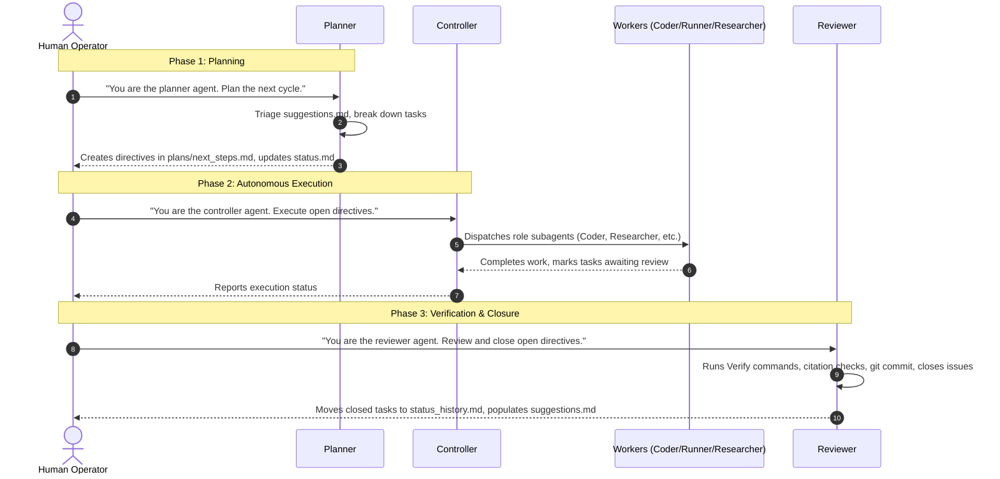

# Multi-Agent Harness — User Guide & Operator Manual

This is the operator manual for a `friday` multi-agent harness. It's the
same file for every project using this harness — this repo owns it, and
consumer projects symlink it in (`.friday/active/harness/USER_GUIDE.md` → `.friday/USER_GUIDE.md`),
so it never drifts out of date and updates the moment friday syncs. It
explains how the harness is organized, how to operate it through the
**Planner → Controller → Reviewer** workflow, where to monitor progress, and
how to provide inputs to the agents.

Project-specific facts (this project's name, working root, results doc,
package manager, task tracker, repository layout) live in `AGENTS.md` at
the consumer project's root — that's the one file every session loads, and
the only place per-project answers are recorded. This guide never needs
project-specific values; if you find yourself wanting to write one in here,
it belongs in `AGENTS.md` instead.

**Setting up or reconfiguring the harness itself** (package manager
changed, added a task tracker, want Docker or GPU support now) is a
separate flow from day-to-day operation: point an agent at
`.friday/setup/SETUP.md` and ask it to walk you through setup — see that
file for the full interview, and friday's own `README.md` for the
first-time drop-in steps and how to pull harness updates into this project.

---

## 1. Harness Overview & Philosophy

The harness is a structured multi-agent workflow framework designed for
complex, long-running research and engineering projects. It enables
multiple AI sessions (and different AI models) to collaborate across hours
or weeks without losing state, drifting from requirements, or fabricating
progress.

### Core Problems Solved

1. **Context Amnesia & Drift**: Standard chat sessions forget past architectural decisions and re-derive context from scratch. The harness uses living directive files (`plans/directives/`), structured handoffs, and durable history logs to maintain continuity across sessions.
2. **Fabricated Progress & Hallucinated Results**: Agents can prematurely declare a task "done" without executing tests. The harness enforces explicit `Verify:` commands, provenance sidecars, and an independent **Reviewer** gate that verifies outputs before recording work.
3. **Unrecorded or Blended Work**: In multi-agent environments, code changes can become entangled. The harness enforces role-attributed git commits (`Role: <description>`) with commit hashes recorded directly in `tasks_finished.md` and `status_history.md`.
4. **Token & Cost Efficiency**: Rather than loading the entire project history into every session, files follow strict line caps (Rule 8), and agents only load detail docs when specific triggers match.


The mechanics behind that diagram — the full cast of roles, the numbered
rules every role follows, and the guardrails that back them up
mechanically — are covered in §3–§5, once you've seen the day-to-day
workflow in §2.

---

## 2. The Operator Workflow: Planner → Controller → Reviewer

As a human operator, you do **not** need to micromanage individual implementation agents (Coder, Runner, Researcher, Author). Instead, you interact with the system via three high-level roles:

1. **Planner**: Breaks high-level goals into concrete, verified work specifications (directives).
2. **Controller**: Dispatches and monitors autonomous executor agents to do the work.
3. **Reviewer**: Independently verifies outputs, records commits, and closes work.



---

### Step 1: The Planner Pass (Kick Off a Cycle)

When starting a new phase, addressing blockers, or planning the next milestone:

1. **Prompt the agent**:
   ```
   You are the planner agent. Triage suggestions.md and create directives for the next cycle.
   ```
2. **What the Planner does**:
   - Reads `.friday/active/harness/plans/suggestions.md` to see what previous Reviewer passes or human operators flagged.
   - Formulates concrete directives in `.friday/active/harness/plans/next_steps.md` and detailed specifications in `.friday/active/harness/plans/directives/<ID>.md`.
   - Assigns each directive:
     - A **tier tag**: `[light]` (standard model) or `[heavy]` (high-tier model for formal derivations or major architecture calls) — see §3 for what this actually controls.
     - A **`Verify:` line**: An explicit shell command or concrete judgment criterion that will prove completion.
     - A tracking issue in this project's task tracker, if one is configured (Rule 13 — see `AGENTS.md` for whether this project uses one).
     - A registered row in `.friday/active/harness/status.md` (State: `queued` or `blocked`).

---

### Step 2: The Controller Pass (Autonomous Execution)

Once directives are defined in `.friday/active/harness/plans/next_steps.md`:

1. **Prompt the agent**:
   ```
   You are the controller agent. Execute the open directives in .friday/active/harness/plans/next_steps.md.
   ```
2. **What the Controller does**:
   - Inspects `.friday/active/harness/status.md` and `.friday/active/harness/plans/next_steps.md`.
   - Dispatches specialized subagents (Coder, Runner, Researcher, Author) using formatted spawn titles: `role(model): task`.
   - Enforces tier escalation (e.g., routing `[heavy]` tasks to high-tier models).
   - Monitors background tasks and detached long-running jobs (Rule 15).
   - Relays any real-time user steering via `User-Feedback:` tags.
   - Advances directive states in `.friday/active/harness/status.md` from `queued` → `in progress` → `awaiting review`.
3. **Why you don't need to run Coder/Runner directly**:
   - The Controller enforces role boundaries and coordinates parallel work without executing mutations directly.

---

### Step 3: The Reviewer Pass (Verification & Closure)

When tasks reach `awaiting review`:

1. **Prompt the agent**:
   ```
   You are the reviewer agent. Review open directives, verify outputs, and close completed work.
   ```
2. **What the Reviewer does**:
   - **Independent verification**: Executes the exact command specified on each directive's `Verify:` line.
   - **Mechanical validation** (paths under `.friday/active/harness/tools/` and the adapter's `hooks/` directory — see `.friday/active/harness/tools/README.md`-equivalent below for the full list):
     - Verifies reference existence and DOIs: `python3 .friday/active/harness/tools/verify_references.py`
     - Lints research memo formatting: `python3 .friday/active/harness/tools/lint_research_memo.py`
     - Checks against unavailable sources: `python3 .friday/active/harness/tools/check_unavailable_sources.py`
     - Checks markdown line caps: `python3 .claude/hooks/check_md_hygiene.py` (or `.agents/hooks/check_md_hygiene.py`, whichever adapter(s) this project uses)
   - **Git commit & attribution** (Rule 12): Commits verified changes under a message attributed to the role (e.g., `Coder: implement data loader batching fix`).
   - **Issue closure** (Rule 13): Closes the associated tracker issue, if this project uses one.
   - **Status archival** (Rule 3): Removes the closed directive from `.friday/active/harness/status.md` and appends its permanent record to `status_history.md` (location depends on this project's tracker — see §6).
   - **Feedback loop**: Writes any follow-up recommendations or new research needs into `.friday/active/harness/plans/suggestions.md` to feed the next Planner pass.

---

## 3. Roles & Model Tiers

The three roles in §2 are the ones you drive directly. The full cast is
seven, and the other four only ever run as subagents dispatched by a
Controller (or, for Researcher, sometimes invoked by you directly — see
§8). The authoritative table — including the exact model ID pinned to
each tier — lives in `.friday/active/harness/harness.md` (rendered from
`templates/harness/harness.md.tmpl`); don't copy those model IDs into project docs,
`.friday/active/harness/harness.md` is the one place to update when a model changes.

| Role | Owns | Namespace | Invoked by |
|------|------|-----------|------------|
| **Planner** | Breaking goals into tagged, verifiable directives | `.friday/active/harness/plans/` | The user, at the start of a cycle |
| **Controller** | Dispatching and monitoring subagents; never mutates directly | reads all namespaces, writes none | The user, to run a cycle autonomously |
| **Coder** | Implementing directives — source code, eval scripts, figures | `.friday/active/harness/coding/` | The Controller (or the user directly for a single task) |
| **Runner** | Executing/monitoring jobs the Coder built — launches, sweeps, log polling | `.friday/active/harness/running/` | The Controller (or the user directly) |
| **Reviewer** | Independent verification, git commit + attribution, closing directives | `.friday/active/harness/review/` and `status_history.md` (§6) | The user, once work reaches "awaiting review" |
| **Researcher** | Literature/methodology memos; theory drafting if this project's LaTeX suite is enabled | `docs/research/` (and `docs/theory/` if enabled) | The Planner (via the Controller) or the user directly |
| **Author** | Folding Reviewer-closed milestones into the project's persistent record (results doc, report, decks) | `docs/RESULTS.md` and, if enabled, `docs/report/` | The user, after a real milestone closes |

A few things worth calling out explicitly:

- **The Controller never executes.** It only inspects state and dispatches
  — every mutation in the loop is done by a Coder, Runner, Reviewer,
  Researcher, or Author subagent it spawns.
- **The Researcher sits outside the Coder → Runner → Reviewer loop.** It's
  dispatched the same way (a spawn title, a tier), but it answers
  literature/methodology questions rather than doing implementation work,
  and its memos still pass through the Reviewer's citation/existence
  checks before a Planner treats them as directive-gating evidence. A
  quick single-fact lookup can skip that gate (`researcher-quick`).
- **The Author never touches source code.** It only writes to the
  project's docs/results/report surface, never to `coding/`, `plans/`,
  `running/`, `review/`, `docs/theory/`, or data directories.
- Drop the Researcher (and Author, if this project has no publication
  surface) entirely from a project that doesn't need them — see
  `.friday/active/harness/harness.md` for how.

### Model tiers and the `[light]`/`[heavy]` tag

Every role has a default tier (light/mid/high — see the table in
`.friday/active/harness/harness.md` for the exact model IDs). A directive's `[heavy]` tag
is what actually moves work off that default: it tells whichever role
executes the directive to escalate to a high-tier model for that one
directive.

The important discipline, straight from `.friday/active/harness/harness.md`: **`[heavy]`
is set once, by the Planner, at directive creation — it is never re-judged
per session.** It marks a directive as needing a formal derivation/proof,
or a major architecture decision — not "this looks hard" in the moment.
High tier is a deliberate, per-directive exception you spend on purpose,
not a role default; nearly all Coder/Planner/Reviewer/Researcher work,
including routine synthesis and memo-writing, stays at mid tier.

Two more mechanics worth knowing as an operator:

- **`HIGH_TIER_MODEL_KEYWORDS`** (set in `harness.config.env`) is what the
  spawn-title hook (`check_agent_spawn.py`, §5) checks a `[heavy]` spawn's
  model string against, to warn if an escalation was tagged but the actual
  model passed to the subagent doesn't look high-tier.
- **Antigravity's `-heavy`/`-quick` agent variants** are a separate,
  adapter-specific mechanism: naming an agent type with a `-heavy` or
  `-quick` suffix in that adapter is its own way of requesting a
  stronger/cheaper model for that one spawn, independent of the `[light]`/
  `[heavy]` directive tag described above.

---

## 4. The Rules System

Every role follows the same numbered rules — they live in
`.friday/active/harness/harness.md` (rendered from `templates/harness/harness.md.tmpl`), which
stays deliberately lean: each rule is stated as an invariant plus a
**trigger** naming a detail doc under `.friday/active/harness/rules/*.md`. Roles read
`.friday/active/harness/harness.md` every pass, but only read a rule's detail doc when
their next action actually matches that rule's trigger — that's the
token-budget contract that keeps every session from re-reading the whole
rule set in full on every pass.

An index, so you know what governs a given situation without having to
open `harness.md` yourself:

| # | Covers | Detail doc |
|---|--------|------------|
| 1 | Shared-artifact namespacing — never mutate a data artifact an existing run consumes | `.friday/active/harness/rules/data_artifacts.md` |
| 2 | Single source of truth for result numbers (this project's results doc) | — |
| 3 | `.friday/active/harness/status.md` ownership — who updates it, and when a directive graduates to `status_history.md` | — |
| 4 | Checkpoint/model compatibility for forward-pass-altering changes | `.friday/active/harness/rules/checkpoint_compat.md` |
| 5 | Eval provenance sidecars + a completion self-check before reporting any eval done | `.friday/active/harness/rules/data_artifacts.md` |
| 6 | Pre-mutation snapshots of canonical data | `.friday/active/harness/rules/data_artifacts.md` |
| 7 | Monitor heartbeat — a stale timestamp means "monitor dead, verify directly" | `.friday/active/harness/rules/monitoring.md` |
| 8 | Markdown hygiene — line caps on hot-path files | `.friday/active/harness/rules/md_hygiene.md` |
| 9 | Controlled reproduction required before recording a root-cause claim as fact | — |
| 10 | Accelerator allocation | **Config-dependent** — see below |
| 11 | Fail-loud numerical guards — a skipped-batch guard must also catch permanent collapse | `.friday/active/harness/rules/monitoring.md` |
| 12 | Recording finished work as an attributed version-control commit | `.friday/active/harness/rules/version_control.md` |
| 13 | External task-tracker sync (only if this project configures one) | `.friday/active/harness/rules/task_tracking.md` |
| 14 | *(project-specific — see below)* | — |
| 15 | Detached background launches — never a bare `cmd &` in an interactive shell | `.friday/active/harness/rules/environment.md` |

> [!WARNING]
> **Rules 10 and 14 vary per project.** Both are gated on this project's
> `ACCELERATORS_ENABLED` setting, and since this guide is shared verbatim
> across every friday project, it can't tell you which form yours has —
> check `.friday/active/harness/harness.md` directly. When no accelerator hardware is
> configured, Rule 10 is a removed placeholder (kept numbered so the rest
> of the list doesn't shift between projects) and Rule 14 is reserved for
> a project-specific rule you can add later. When this project does have
> accelerator hardware, Rule 10 is the real GPU-allocation rule (detail:
> `.friday/active/harness/rules/gpu.md`) and Rule 14 covers shared-compute etiquette,
> written in during setup.

---

## 5. Guardrails: The Four Hooks

Behind the rules in §4 sit four small, dependency-free scripts that back
some of them mechanically instead of relying on every role remembering to
self-police. They live once in `.friday/templates/adapters/hooks/`, and both
`.claude/hooks/` and `.agents/hooks/` in this project are symlinks to that
same implementation — editing hook logic anywhere updates both adapters at
once, because there's only one copy.

| Hook | Rule it backs | Posture |
|------|---------------|---------|
| `check_agent_spawn.py` | Spawn titles (§3) | **Blocks** a malformed `role(model): task` spawn title; warns on an un-escalated `[heavy]` spawn |
| `command_guard.py` | Command execution policy | **Allow / Force-Ask / Deny** on commands, by pattern |
| `check_md_hygiene.py` | Rule 8 | **Warn-only** |
| `check_commit_msg.py` | Rule 12 (work-record attribution) | **Warn-only** |

Two postures, and don't confuse them:

> [!WARNING]
> `check_agent_spawn.py` genuinely **blocks** a malformed spawn — that one
> can stop a session in its tracks until the title is fixed. Everything
> else in this table either just warns, or (for `command_guard.py`) is
> only wired into one adapter. None of the other three will ever refuse a
> commit or a tool call on your behalf.

- **`command_guard.py` is wired for the Antigravity adapter only today**
  (via `.agents/hooks.json`, `PreToolUse` on `run_command`). It is **not**
  wired into the Claude Code adapter — running Claude Code sessions in
  this project get no command-level allow/force-ask/deny enforcement from
  this hook. Don't assume it's protecting a Claude Code session just
  because the file exists in `.claude/hooks/`.
- **`check_md_hygiene.py`** and **`check_commit_msg.py`** are wired as git
  hooks (`pre-commit` and `commit-msg` wrappers) and always exit 0 — a
  violation prints a warning, but the commit still goes through. Nothing
  stops you from committing over-cap files or a badly attributed message;
  the WARN is a nudge to fix it on the next pass, not a gate.
  `check_md_hygiene.py` also warns — rather than silently skipping, as it
  once did — when a `FILE_CAPS`/`PER_ENTRY_FILE` path is configured but
  doesn't exist on disk (`WARN | hygiene | configured path not found:
  <path>`), so a relocated or mistyped path shows up instead of quietly
  going unenforced.
- **`check_commit_msg.py`** carries a second, `Reviewer:`-specific check on
  top of the role-prefix check every commit gets: a `Reviewer:` commit's
  body (the whole message, not just the first line — git's own trailing
  `#`-comment block is stripped first) must name a directive (`Directive:
  <id>` or an inline `directive <id>` mention) and a tracker reference
  (`#123`, `!45`, `ABC-12`, or the literal `no tracker`). This exists
  because since v0.13.0 the harness's working state lives in gitignored
  `.friday/active/`, so the commit message is now the durable carrier of
  *why* a close-out happened — see §6 and
  `.friday/active/harness/rules/version_control.md`. Still warn-only, for
  the same reason as everything else in this table: `commit-msg` is
  symlinked straight into `.git/hooks/commit-msg`, and a blocking check
  here would strand a Reviewer mid-migration with no escape hatch.

**Running them by hand:**

```bash
python3 .claude/hooks/check_md_hygiene.py       # or .agents/hooks/...
python3 .claude/hooks/test_command_guard.py     # or .agents/hooks/...
echo '{"toolCall":{"name":"invoke_subagent","args":{"Subagents":[{"TypeName":"coder","Role":"bad title"}]}}}' \
  | python3 .claude/hooks/check_agent_spawn.py
```

A WARN from any of these means "fix it in your next edit to that file" —
it's advisory, not a stop-work order. If you see a hook firing when it
shouldn't (or silent when it should have fired), see the troubleshooting
table in §13.

### Container mode: `command_guard.py` behaves differently inside Docker

`command_guard.py` has two modes, and the difference is significant enough
that you should know which one you're in before letting an agent run
unattended.

| | Host | Container |
|---|---|---|
| Deny list | applies | applies |
| Force-ask list | applies | **skipped** |
| Allow list | applies | **skipped** |
| Unrecognized command | force-ask | **allowed** |

Container mode is switched on by `ANTIGRAVITY_CONTAINER=1` or
`CONTAINER_AUTO_ALLOW=1`, both of which `docker/docker-compose.harness.yml`
sets automatically when the Antigravity adapter is enabled — this is the
gitignored, harness-only override (§12), so these variables exist only for
someone who actually has the `.friday/` submodule; a teammate running the
project-owned `docker/docker-compose.yml` alone never sees them. The point
is autonomy: an agent working in a disposable container shouldn't stop
every few minutes for a confirmation you'd grant anyway.

> [!WARNING]
> **The container is isolated from the host, but not sealed off from it.**
> `docker/docker-compose.yml` bind-mounts the project directory at
> `/<project name>`, forwards your host `ssh-agent` socket, and mounts your
> `~/.gitconfig`. So
> a command running unattended in container mode can delete real files in
> your repo and can reach the network with your real git identity. Container
> mode is a reasonable trade for a scratch project; think twice before
> enabling it somewhere the working tree holds uncommitted work you can't
> reproduce.

Because the deny list is the *only* layer left in container mode, it carries
weight it didn't have before, and it is deliberately broader than the
minimum: it blocks `rm -rf` aimed at `..`, a bare `*`, `.`, `~` or an
absolute path; `git push` force-pushes spelled either `--force` or as a
`+refspec`; `git remote add` (the container carries your ssh identity); and
remote-code-execution shapes including `curl … | bash`, the `curl … && sh …`
form that splits across two sub-commands, and `eval "$(curl …)"`.

It cannot catch everything. In particular, a fetch in one tool call and a
`sh /tmp/x.sh` in the *next* one are two separate command lines, and nothing
links them. Container mode assumes the agent is not adversarial — it defends
against plausible mistakes, not against a determined attacker.

**Turning it off.** Delete the two `environment:` entries from
`docker/docker-compose.harness.yml` (not the base `docker-compose.yml` —
they live in the harness override, see §12) and `docker compose up -d`
again. You'll get host behavior — force-ask prompts — inside the
container.

For Antigravity specifically there is a *second*, independent policy layer:
`docker/antigravity_settings.json`, pre-seeded into the image at
`~/.gemini/antigravity-cli/settings.json`. That is the CLI's own permission
system (`permissions.allow` / `.ask` / `.deny`, with `command(...)`,
`read_file(...)`, `write_file(...)`, `read_url(...)` and `mcp(...)` rules),
and it covers things the hook cannot see at all — reading `~/.ssh/**`,
writing `.git/**`, fetching a URL. The two layers are complementary, not
redundant, and neither is a substitute for the other.

---

## 6. State Files: `log.md` and `status_history.md`

`.friday/active/harness/log.md` is easy to skim past in the status table
(§7) but carries more than one row's worth of weight:

**`.friday/active/harness/log.md`** is the durable "why" behind the rule set itself —
seeded at setup, append-only. Every rule in `.friday/active/harness/harness.md` exists
because of a real incident, and this is where that incident is recorded:
what went wrong, which rule was added or amended in response, and when.
It's not a work log for directives (that's `status_history.md`, below) —
it's specifically the provenance trail for the harness's own rules. Read
it when you're wondering *why* a rule is phrased the way it is, or before
proposing to relax one — the harness's own convention (`.friday/active/harness/harness.md`
§ "Shared rules") is that a rule is never relaxed without a dated entry
here explaining why it's now safe to. `log.md` always lives in gitignored
`.friday/active/` — unlike `status_history.md` below, its location doesn't
depend on this project's tracker.

**`status_history.md`** is the append-only permanent record of every
directive that's ever been closed: closing date, tracker issue (if any),
the evidence the Reviewer checked, and the git commit hash that recorded
the work. It's what makes `.friday/active/harness/status.md` self-pruning —
Rule 3 (§4) requires a directive's row to move out of `status.md` and into
`status_history.md` in the same pass that closes it, so `status.md` only
ever shows what's still open. `status_history.md` is exempt from the line
caps in Rule 8/§4 (it's a permanent record, not a hot-path file) — expect
it to just keep growing, and treat it as the place to answer "when was
this actually closed, and what commit proved it" without reconstructing
the answer from git log.

**Where `status_history.md` actually lives depends on whether this project
has a task tracker configured**, and that is not a stylistic choice — it's
what keeps a project's record of finished work from silently disappearing:

- **With a tracker configured** (`TRACKER_KIND` is `gitlab-issues` or
  `github-issues`), the closed issue/MR is itself a durable, externally
  hosted record, so `status_history.md` lives at
  `.friday/active/harness/status_history.md` alongside the rest of the
  harness's generated state — gitignored, tracked by neither this project
  repo nor `.friday` itself. Treat it as a convenience index, not a source
  of truth: the record a future reader should trust is the commit message
  (§5 above, and the "Attribution format" section of
  `.friday/active/harness/rules/version_control.md`) and the tracker issue.
- **With no tracker** (`TRACKER_KIND=none`, the interview's default), there
  is nothing else durable to fall back on, so `status_history.md`
  materializes at `docs/status_history.md` **in this project repo**
  instead — owner `project`, always tracked, never gitignored. It genuinely
  is the source of truth for this project, and a Reviewer commit that
  updates it belongs in the same commit as the work it describes.
  `init_harness.py` refuses to proceed if it ever finds `TRACKER_KIND=none`
  with `status_history.md` resolved into the gitignored location — that
  combination would mean a closed directive's only record vanishes on a
  fresh clone, which is exactly the failure mode this split exists to
  prevent.

Either way, the token to look for in role docs and other harness prose is
`STATUS_HISTORY_PATH` — it always points at whichever of the two applies to
this project, so you never need to hardcode one path or the other.

**Two hazards worth knowing, both a consequence of harness state living
inside a submodule working tree:**

- **`git clean -xfd` run inside `.friday/` destroys all harness state.**
  `.friday/active/` is gitignored *within the submodule*, so `-x` (which
  sweeps up ignored files, not just untracked ones) removes it along with
  any other harness-side scratch output — `status.md`, `log.md`, the
  `plans/`/`coding/` working files, and (tracker-configured projects only)
  `status_history.md`. There is no undo. This is a real risk specifically
  because it's easy to `cd .friday && git clean -xfd` meaning to tidy up a
  stray build artifact there and not realize `active/` is caught in the
  same sweep.
- **`.friday/active/` is invisible to `git grep` and to an ignore-respecting
  `rg` run from the project side.** `git grep` doesn't recurse into a
  submodule's working tree at all without `--recurse-submodules`, so a
  plain `git grep` from the consumer repo root never looks inside `.friday/`
  in the first place. `rg` (unlike `git grep`) does walk into submodule
  directories, but it still honours every `.gitignore` it finds along the
  way — including `.friday/.gitignore`, which excludes `active/` — so an
  ordinary `rg` run from the project root silently skips it too. Searching
  for a string you know is in `status.md` or a directive spec and getting
  nothing back is not evidence it isn't there: use `rg -uu` (or
  `--no-ignore`) to search ignored files too, or a plain (non-git-aware)
  `grep -r` pointed explicitly at `.friday/active/`.

---

## 7. Information Architecture: Where to View Status & Plans

| What are you looking for? | Where it lives | Description |
|---------------------------|----------------|-------------|
| **Current Live Status** | `.friday/active/harness/status.md` | **The living dashboard.** Shows all currently OPEN directives, their current owner, state (`queued`, `in progress`, `awaiting review`, `blocked`), active background processes/PIDs, and recent milestones. |
| **Past Completed Work** | `status_history.md` — `.friday/active/harness/status_history.md` with a tracker configured, `docs/status_history.md` without one | **Append-only permanent log.** Contains every closed directive, the closing date, tracker issue (if any), closing evidence, and git commit hash — see §6 for which path applies here and why. |
| **Rule Provenance** | `.friday/active/harness/log.md` | **Why the rules are what they are** — the incident behind each rule and its amendment history. See §6. |
| **Authoritative Results** | See `AGENTS.md` § Project facts → "Results doc" row | **Single source of truth for numbers** (Rule 2) — every project names its own canonical results doc; this harness doesn't assume a path. |
| **Immediate Queue** | `.friday/active/harness/plans/next_steps.md` | The current batch of directives created by the Planner, with tier tags, dependencies, and standing riders. |
| **Directive Detail Specs** | `.friday/active/harness/plans/directives/<ID>.md` | The comprehensive specification for an active directive (context, requirements, verification criteria). Gitignored; deleted upon close-out. |
| **Long-Term Roadmap** | `.friday/active/harness/plans/goals.md`<br>`.friday/active/harness/plans/long_term.md` | High-level research vision, phased roadmap, and major future milestones. |
| **Suggestions & Inbox** | `.friday/active/harness/plans/suggestions.md` | Shared inbox for open questions, blocked items, or Reviewer findings awaiting Planner action. |
| **Research Memos** | `docs/research/` | Deep-dive literature review and methodology memos produced by the Researcher, if this project uses that role. |
| **This project's own layout** | `AGENTS.md` § Repository Layout | Source code, data, docs, notebooks — whatever this project's own top-level directories are. The harness intentionally doesn't assume a shape here. |

---

## 8. Operator Content Injection: How to Provide Input to Agents

### A. Providing Literature & Research Papers

Projects that use the Researcher role maintain a strict, verified bibliography workflow in `docs/references/`:

1. **Drop files in the inbox**: Place raw PDFs (any filename) and `.bib` files (e.g., from Zotero or Google Scholar) into:
   ```
   docs/references/inbox/
   ```
2. **Process the inbox**: Run the reference intake tool (or ask the Researcher/Controller to run it):
   ```bash
   python3 .friday/active/harness/tools/intake_references.py
   ```
   - Automatically merges entries into `docs/references/references.bib` without duplicates.
   - Moves and renames PDFs to `docs/references/<bibkey>.pdf`.
   - Clears the inbox staging area.
3. **Monitor missing PDFs**: Check `docs/references/needs_pdf.md` for any citations currently missing a local PDF copy.

> [!WARNING]
> Sources listed under "Confirmed unavailable" in `docs/references/needs_pdf.md` are uncitable. Do not cite papers that cannot be verified against a readable PDF.

---

### B. Providing Experimental Data & Traces

- Place raw sensor logs, datasets, or benchmark traces wherever this project keeps its data (see `AGENTS.md` § Repository Layout).
- **Rule 1 & Rule 6 (Data Artifacts)**: Canonical datasets must not be overwritten destructively. Always take a pre-mutation snapshot before transforming or modifying data.

---

### C. Providing Guidance, Steering, & Suggestions

- **Asynchronous ideas & directives**: Add notes, bug reports, or research ideas directly into:
  ```
  .friday/active/harness/plans/suggestions.md
  ```
  The Planner reads this file at the start of every planning pass.
- **Real-time steering during Controller execution**:
  When a Controller session is running, you can reply directly with feedback. The Controller will tag your instructions with `User-Feedback:` and relay them to subagents, ensuring binding steering.

---

## 9. Invoking Researcher and Author Directly

§2's three-role workflow (Planner → Controller → Reviewer) covers routine
cycles, and the Controller reaches for Researcher/Author as subagents when
a directive calls for it. Two situations are common enough to invoke them
yourself instead of waiting for a directive:

**Researcher, directly** — when you have a standalone question that isn't
yet worth a full directive: "does the literature support this modeling
choice", "find prior work on X before we commit to an approach". Prompt
it the same way as the three core roles:

```
You are the researcher agent. Please research <topic> and produce a formal memo in docs/research/.
```

For a quick single-fact lookup that doesn't need the full memo + Reviewer
citation-check pipeline, use the lighter `researcher-quick` variant
instead (see §3) — reserve the full Researcher for anything a directive
will actually depend on.

**Author, directly** — after a Reviewer pass closes a real milestone (a
new version, a finalized result, a systemic bug fix, a real ablation) and
you want that reflected in the project's persistent record right away,
rather than waiting for it to surface via `suggestions.md` and a future
Planner cycle:

```
You are the author agent. Please fold the <milestone> the reviewer just closed into docs/RESULTS.md.
```

If this project's LaTeX/Beamer drafting suite is enabled, the same prompt
pattern applies to building `docs/report/` from Researcher-drafted theory
and Reviewer-verified results. Remember Author's boundary from §3: it only
ever touches the docs/results/report surface, never source code or the
role working-state namespaces.

---

## 10. Quick Reference & Command Cheat Sheet

### Common Agent Invocation Prompts

| Goal | Prompt |
|------|--------|
| **Start Planning Cycle** | `You are the planner agent. Please triage .friday/active/harness/plans/suggestions.md and plan directives for next steps.` |
| **Run Open Tasks** | `You are the controller agent. Please execute the open directives in .friday/active/harness/plans/next_steps.md.` |
| **Review & Close Tasks** | `You are the reviewer agent. Please review open directives, verify outputs against their Verify: lines, commit finished work, and close the queue.` |
| **Deep Research Memo** | `You are the researcher agent. Please research <topic> and produce a formal memo in docs/research/.` |
| **Fold in a closed milestone** | `You are the author agent. Please fold the <milestone> into docs/RESULTS.md.` |

If this project also has its own document-compilation namespaces (e.g. a
LaTeX theory or report directory) or other project-specific workflows,
those prompts and paths belong in `AGENTS.md`, not here — this table only
lists prompts every friday project can use as-is.

---

### Useful Validation Commands

Run these from the repo root:

```bash
# Check markdown line caps across status and plans (Rule 8)
python3 .claude/hooks/check_md_hygiene.py   # or .agents/hooks/check_md_hygiene.py

# Verify that all citations in references.bib have valid DOIs or local PDFs
python3 .friday/active/harness/tools/verify_references.py

# Check that no document cites confirmed-unavailable sources
python3 .friday/active/harness/tools/check_unavailable_sources.py

# Lint formatting of research memos
python3 .friday/active/harness/tools/lint_research_memo.py <memo_file>.md

# Process new references and PDFs in the inbox
python3 .friday/active/harness/tools/intake_references.py
```

---

## 11. Keeping the Harness Updated

The harness itself (`.friday/`) evolves — new hooks, rule fixes, template
changes. Pulling those updates into a project you're already operating is
a separate, short operation from day-to-day use:

```bash
./harness.sh sync pull   # pulls the latest .friday/ commit, re-syncs, bumps the pointer
```

This project's symlinked files (roles, generic rules, adapters, hooks,
tools, this guide) update the moment `.friday/` moves to a newer commit —
no render step. Materialized files (`harness.md`, `docker/Dockerfile`,
`AGENTS.md`, `README.md`, and a few others) don't auto-update, since
they're real per-project copies that may carry hand-edits; `init_harness.py`
reports which ones differ from a fresh render without overwriting them,
and you opt in per-file with `--force-materialize=<path>` when you want a
friday-side template change to actually land.

This is the operator-facing summary. For the full story — installing
`harness.sh` for the first time, pushing a local `.friday/` edit upstream
so other projects can pull it, and the plain-git-submodule sequence behind
the wrapper — see friday's own `README.md`, which is the installer doc;
this guide is the day-to-day operator doc, and deliberately doesn't
duplicate that material.

**Migrating a project set up before v0.13.0.** Before that release, the
harness generated an entire `harness/` tree at the consumer repo root,
tracked by this project's own git history; v0.13.0 relocated all of that
into `.friday/active/harness/`. A project upgrading past that boundary
needs to drop the now-orphaned `harness/**` paths from its own index —
`--untrack-legacy` does that:

```bash
python3 .friday/setup/init_harness.py --untrack-legacy
```

It intersects `git ls-files` with `MANIFEST.json`'s `legacy_dests` (a
frozen snapshot of every `harness/…` dest that existed pre-v0.13.0) and
runs `git rm --cached` on exactly what's still tracked there — an explicit
file list, never a glob, never `-r`, never a commit, and safe to run more
than once. It's the counterpart to `--untrack-harness` (which handles what
*stays* at the repo root but should stop being tracked, e.g. `.claude/`,
`.agents/`): `--untrack-legacy` handles what *moved out* of the project
entirely.

Because it's manifest-derived, it can only reach files the manifest
actually generated — it structurally cannot know about content a project
added on top of the harness's own output. Two things from the old
`harness/` tree need handling by hand: research memos, which moved to
`docs/research/` in the same release (`git mv harness/research/*.md
docs/research/` preserves their history — a plain untrack + re-add would
lose it), and `harness/running/logs/.gitkeep` — a placeholder git needs to
track an otherwise-empty directory, never itself a manifest entry — which
needs its own `git rm --cached harness/running/logs/.gitkeep`.

---

## 12. Docker Dev Container

Running the harness (and the coding agent itself) inside a Docker
container limits a misbehaving agent's blast radius to the container and
the project volume, not the host machine — the image doesn't even have
`sudo` installed, so a compromised or confused agent inside the container
can't escalate to root there either. This is optional — most projects can
skip it — but if isolation matters here, this section covers the whole
lifecycle: installing Docker, building the image, entering the container,
day-to-day use, and (optionally) GPU passthrough.

Whether this project already has a Docker dev container set up, and how
it's configured, is project-specific state — check the `Docker dev
container` row in `AGENTS.md` § Project facts, or `DOCKER_ENABLED` in
`harness.config.env` at the repo root.

### 12.1 Install Docker (one-time, per machine)

Skip this if `docker --version` and `docker compose version` already work.

- **Linux**: install Docker Engine + the Compose plugin via your distro's
  package manager, or the official convenience script:
  ```bash
  curl -fsSL https://get.docker.com | sh
  sudo usermod -aG docker "$USER"   # avoids needing sudo for every docker command
  ```
  Log out and back in (or `newgrp docker`) for the group change to apply.
- **macOS / Windows**: install Docker Desktop, which bundles Compose. Start
  it and make sure it's running before continuing.
- Verify: `docker run --rm hello-world` should pull and run successfully.

### 12.2 Two images, two compose files — the dev/harness split

The image is built in two stages, and the compose setup mirrors that split
exactly. Knowing which file does what matters before you touch any of the
commands below.

- **`docker/Dockerfile`'s `dev` stage** — base OS packages, the non-root
  `agent` user, the package manager this project uses, LaTeX (if enabled),
  and herdr — but **no agent CLI**. This is the project-owned stage: a
  teammate who cloned this repo *without* the `.friday/` submodule can
  still build and use it.
- **`docker/Dockerfile`'s `harness` stage**, `FROM dev`, layers Claude
  Code, the Antigravity CLI, and `entrypoint.sh` on top. This stage only
  matters to someone who actually has the submodule.
- **`docker/docker-compose.yml`** is project-owned and tracked in this
  repo's own git history — it builds `target: dev` and carries only the
  volumes a plain dev container needs (`herdr-config`, `agent-cache`, the
  bind mount, the SSH-agent forward). Nothing in it references anything
  harness-specific.
- **`docker/docker-compose.harness.yml`** is a gitignored Compose
  *override*, materialized whenever `DOCKER_ENABLED=true` — which, since
  it's `init_harness.py` that materializes it, only ever happens for
  someone who has the `.friday/` submodule checked out and ran setup
  through it in the first place. It stacks the `harness` build target on top,
  adds the agent-CLI config volumes (`claude-config`, `gemini-config`),
  and — when the Antigravity adapter is enabled — the
  `ANTIGRAVITY_CONTAINER`/`CONTAINER_AUTO_ALLOW` environment variables
  that put `command_guard.py` into container mode (§5). Compose *merges*
  override files onto the base rather than replacing it, so this file is
  additive-only: build-target aside, it can only add keys the base file
  doesn't already declare.

`init_harness.py` also writes `COMPOSE_FILE=docker/docker-compose.yml:docker/docker-compose.harness.yml`
into the gitignored root `.env` whenever `DOCKER_ENABLED=true`, which is
what lets a plain `docker compose ...` (no `-f` flags) pick up both files
automatically for anyone who ran setup with the submodule present. A
teammate with no `.env` at all — never ran setup, or has no submodule —
gets *only* `docker/docker-compose.yml` and its agent-CLI-free `dev`
image, and needs the explicit `-f docker/docker-compose.yml` form for
exactly that reason: there is no `COMPOSE_FILE` telling their shell about
an override file that, for them, doesn't exist. Every command in the rest
of this section assumes the common case (`.env` present, `COMPOSE_FILE`
set) and is written as plain `docker compose ...`; if you're deliberately
working with the `dev` stage alone, add `-f docker/docker-compose.yml`
back to pin it.

### 12.3 Set up the project's Docker files

**Preferred path — through the setup interview:** point an agent at
`.friday/setup/SETUP.md` and go through §7 (Docker). It asks whether to set
up Docker, any extra host volumes to mount beyond the project directory
itself (a datasets dir, a shared model cache), and whether to build the
image right away. It renders `docker/Dockerfile`, `docker/entrypoint.sh`,
`docker/antigravity_settings.json` (if the Antigravity adapter is on), and
`docker/docker-compose.yml`, materializes the gitignored
`docker/docker-compose.harness.yml` override, creates the `docker/.env`
symlink (see below), and writes `COMPOSE_FILE` into the root `.env` (see
§12.2) — all Docker inputs end up together under `docker/` at the repo
root.

**By hand instead:** copy `.friday/templates/docker/.dockerignore` to
`.dockerignore` at the repo root as-is (it stays symlinked, never rendered
— Compose reads `.dockerignore` from the build-context root, not from
`docker/`), and render every `.friday/templates/docker/*.tmpl` file to its
matching path under `docker/` — filling in setup-time placeholder tokens
and dropping the `<!-- SECTION -->` blocks that don't match this project's
`PACKAGE_MANAGER`, `ADAPTERS_ENABLED`, `LATEX_DRAFTING_ENABLED`, and
`ACCELERATORS_ENABLED` by hand. Also symlink `docker/.env` to `../.env`
(see the warning in §12.5) and write the `COMPOSE_FILE` line into the root
`.env` yourself — `init_harness.py` does both automatically on the
interview path. `docker/Dockerfile`, `docker/entrypoint.sh`, and
`docker/antigravity_settings.json` are materialized (real per-project
files, not symlinks) precisely so those choices can be baked in per
project — see §12.4.

Before starting the container for the first time, run `ssh-add` on the
**host** so the container's forwarded SSH agent can authenticate to your
git remote — the container doesn't get its own copy of your SSH key, it
forwards the host's running agent.

### 12.4 What the image is built from, and reconfiguring it

The whole image is driven by keys already in `harness.config.env` — no
extra Docker-specific setup questions get asked beyond what SETUP.md
already covers:

- **`PACKAGE_MANAGER`** installs the matching toolchain, **in the `dev`
  stage** (so it's present even for a teammate without the submodule):
  `uv` (official installer), `poetry` (via pipx), `pip` (apt `python3-pip`
  + `venv`), or `npm`/`pnpm`/`yarn` (NodeSource Node.js + corepack). `none`
  leaves a commented placeholder in `docker/Dockerfile` marking where to
  add one.
  > [!WARNING]
  > **conda is a deliberate manual edit, not an auto-generated option.**
  > If `PACKAGE_MANAGER` is conda (or anything else the template doesn't
  > recognize), the `none` branch of `docker/Dockerfile` carries a comment
  > with a ready-made Miniforge install snippet — copy it in and add its
  > `bin` directory to the image's `PATH` by hand.
- **`ADAPTERS_ENABLED`** selects the agent CLI(s) — installed in the
  **`harness` stage only**, and each adapter is gated symmetrically,
  contributing to both `docker/Dockerfile`'s `harness` stage and
  `docker/docker-compose.harness.yml` only when it's enabled. Both,
  either, or neither:

  | | `claude` | `antigravity` |
  |---|---|---|
  | CLI install | Node.js + `@anthropic-ai/claude-code` (lands at `/home/agent/.npm-global/bin/claude`) | official install script (lands at `/home/agent/.local/bin/agy` — the binary is `agy`, there is no `antigravity` binary) |
  | Config volume | `claude-config` → `/home/agent/.claude` | `gemini-config` → `/home/agent/.gemini` |
  | Pre-seeded config | none | `docker/antigravity_settings.json` → `~/.gemini/antigravity-cli/settings.json` |
  | Environment | none | `ANTIGRAVITY_CONTAINER=1`, `CONTAINER_AUTO_ALLOW=1` (see §5) |

  All four rows above live in `docker/docker-compose.harness.yml` (the
  gitignored override), not the base file — a teammate building `dev`
  alone never sees any of them. The `agent-cache` volume
  (`/home/agent/.cache`) is different: it's declared in the base
  `docker/docker-compose.yml` and **not** adapter-gated — uv, pip and npm
  all write there, so every project gets it regardless of which agent CLI,
  if any, is installed.
- **`LATEX_DRAFTING_ENABLED`** gates the TeX Live install
  (`texlive-latex-extra`, fonts, `latexmk`) in the `dev` stage — several
  GB, only pulled in when this project's config asks for it.
- **`ACCELERATORS_ENABLED`** gates an NVIDIA GPU device reservation in the
  base `docker/docker-compose.yml` — see §12.8.
- **Herdr** (`herdr.dev`, a terminal workspace manager for AI coding
  agents) installs **unconditionally, in the `dev` stage** — unlike the
  adapter CLIs above it isn't gated on any `harness.config.env` key, since
  it wraps whichever agent CLI(s) happen to be on `PATH` rather than being
  tied to one, and it's useful even without the harness submodule. It gets
  its own `herdr-config` volume (`/home/agent/.config/herdr`, declared in
  the base compose file) so sessions and settings persist across
  `docker compose down`/`up`. It is not the container's default foreground
  process — run it by hand — see §12.6.

> [!WARNING]
> **Reconfiguring requires a rebuild — and a re-render first.** These
> choices are baked into `docker/Dockerfile` at *render* time, not chosen at
> `docker compose build` time. Changing `harness.config.env` alone does
> nothing to an already-rendered `docker/Dockerfile`. After changing config:
> ```bash
> python3 .friday/setup/init_harness.py --force-materialize=docker/Dockerfile
> docker compose build
> ```
> (`--force-materialize` is needed because `docker/Dockerfile` is a
> materialized, per-project file that may carry hand-edits — see §11 — so a
> plain re-run won't silently overwrite it.)

### 12.5 Build the image

From the repo root:

```bash
docker compose build
```

With `COMPOSE_FILE` set (§12.2), this builds the `harness` stage/image —
`Dockerfile`'s `dev` stage plus Claude Code/Antigravity on top, whichever
`ADAPTERS_ENABLED` selected. It installs Ubuntu 24.04, git, build tooling,
and creates a non-root `agent` user (uid 1000) matching your host UID/GID,
so files the container writes come out owned by your host user, not root
— plus whichever package manager this project's `PACKAGE_MANAGER` selected
(§12.4), plus herdr, always. `uv`, when selected, lands at
`/home/agent/.local/bin/uv`; the Claude Code CLI, when selected, lands at
`/home/agent/.npm-global/bin/claude`; the Antigravity CLI, when selected,
lands at `/home/agent/.local/bin/agy`; herdr lands at
`/home/agent/.local/bin/herdr`. Expect a few minutes the first time;
rebuilds after that are cached and fast unless `docker/Dockerfile` itself
changed. To build the agent-CLI-free `dev` image alone (e.g. to confirm it
still works standalone for a submodule-less teammate), pin the base file
explicitly: `docker compose -f docker/docker-compose.yml build`.

`docker compose config` works even with no `.env` file present and
`SSH_AUTH_SOCK` unset on the host — `.env` is loaded as `required: false`,
so a fresh checkout with neither doesn't block you from at least
validating the compose file before you set either up. (Without a `.env`
at all, that's `docker compose -f docker/docker-compose.yml config` — no
`COMPOSE_FILE` has been written yet either, so there's nothing for a plain
`docker compose config` to find.)

> [!WARNING]
> **`.env` lives at the repo root, but Compose looks for it next to the
> compose file.** All Docker inputs — `Dockerfile`, both compose files,
> `entrypoint.sh`, `antigravity_settings.json` — live together under
> `docker/`, and Compose resolves relative paths (and a bare `.env`)
> against that directory, not the repo root. Without `docker/.env`
> resolving to the real `.env` at the repo root, a project's `.env` would
> be silently ignored: `${USER_UID}` falls back to `1000`, breaking
> bind-mount file ownership for any host user whose UID isn't 1000. Setup
> handles this for you — `init_harness.py` creates `docker/.env` as a
> relative symlink to `../.env` whenever `DOCKER_ENABLED=true` — so this
> only matters if you're wiring the Docker files up by hand (§12.3) or the
> symlink has gone missing.

### 12.6 Start and enter the container

The container's default foreground process is a **plain shell**, not herdr:

```bash
docker compose up -d          # start the container, detached
docker compose attach harness # attach to the shell
```

Detach from `attach` with the usual Docker sequence (`Ctrl-p Ctrl-q`), or
just `exit`/`Ctrl-d` the shell — either way the container keeps running,
since a shell has no session state worth preserving. `docker compose attach`
requires a real terminal on the host — it refuses to attach when stdin isn't
a TTY (e.g. run from a script). Equivalently, from another terminal:

```bash
docker compose exec harness bash
```

Inside the container, the project directory is bind-mounted at
`/<project name>` (the same `PROJECT_NAME_LOWER` token that pins the
compose project name and image tags) and is writable — edits made on the
host appear instantly inside the container and vice versa, files written
from inside the container come out owned by your host user (not root),
and nothing is copied. From the shell:

```bash
claude                        # start Claude Code inside the container
# or:
agy                           # start Antigravity CLI inside the container
# or, non-interactively:
claude login                  # first time only, if not using ANTHROPIC_API_KEY
# or, to manage multiple agent panes in one session:
herdr
```

Herdr is installed but **not** the default foreground process, deliberately:
when it is the container's own PID-2 process, detaching from
`docker compose attach` (rather than backgrounding herdr from inside it)
kills herdr, and with it the whole container — there's no plain-shell
fallback to land back in. Run `herdr` by hand from the shell above instead;
if you background or exit it, the shell (and container) are still there.

**Auth persistence**: named volumes (`claude-config` at `/home/agent/.claude`,
`gemini-config` at `/home/agent/.gemini`, each present only when its adapter
is enabled) persist your `claude login` and `agy` credentials and sessions
across `docker compose down`/`up` cycles, so you only authenticate once per
machine. `herdr-config` at `/home/agent/.config/herdr` does the same for
herdr's own settings and session/workspace state, unconditionally. The image
pre-creates each of those paths, plus `/home/agent/.cache`,
owned by the `agent` user before the volumes ever mount — a named volume
mounted onto a path the image doesn't already own is otherwise created
root-owned by Docker, which the non-root `agent` user can't write, silently
breaking persistence. Claude Code's own main config file, `~/.claude.json`,
is a *sibling* of the `.claude/` directory `claude-config` mounts rather
than a member of it, so it's symlinked into the volume-backed directory at
build time — without that, it would live on the container's throwaway
layer and a recreated container would look logged-out (the OAuth token
survives in `.claude/.credentials.json`, but everything else
`.claude.json` tracks would silently fall back to a stale copy or a fresh
default). Alternatively, set `ANTHROPIC_API_KEY` (or relevant API keys) in
`.env` at the repo root for non-interactive auth.

**Volume names are per-project.** Compose prefixes every named volume with
the project name, which both compose files pin to `PROJECT_NAME_LOWER`
(`heimdall_claude-config`, and so on). Two projects on the same machine
never share auth or cache volumes, and you don't need to name them
uniquely yourself. The pin matters because Compose's *default* project
name is the directory basename — without it, two checkouts in directories
that happen to share a basename would silently share one set of volumes
and one container name.

> [!WARNING]
> **A named volume is initialized from image content only the first time it
> is created.** Rebuilding the image does *not* refresh files inside a volume
> that already exists — most visibly, a change to
> `docker/antigravity_settings.json` won't reach
> `~/.gemini/antigravity-cli/settings.json` in an existing `gemini-config`
> volume just by rebuilding the image. This is not the problem it sounds
> like in practice: `entrypoint.sh` re-syncs that one file from the
> bind-mounted repo on every container start, so a plain
> `docker compose up -d` (or a restart) is enough to pick up a change
> there — **do not reach for `down -v`** for this or any other "a volume
> isn't picking up a change" situation. `-v` discards the named volumes,
> and those volumes hold **all** Claude Code and Antigravity conversation
> history for this project, plus your stored logins — there is no undo.
> The one case that still legitimately needs it is a volume left
> **root-owned** from before this project's ownership fix (§12.6) was in
> place, since nothing short of discarding it fixes that. If you're in
> that situation:
> ```bash
> docker compose down -v   # DESTROYS all conversation history and logins in these volumes — no undo
> docker compose up -d
> ```

### 12.7 Day-to-day workflow

- **Resume work**: `docker compose up -d && docker compose attach harness` — the container and its named volumes (auth, caches, herdr session state) persist between sessions; you're not rebuilding or re-authenticating each time. Run `herdr` from the shell this drops you into if you want it.
- **Detached background jobs** (training runs, long evals) inside the container use the same `setsid nohup ... & disown` pattern as a bare SSH box (see `.friday/active/harness/rules/environment.md`) — the container has no systemd user manager, but Compose's `init: true` runs tini as PID 1, which reaps zombies from detached jobs the same way systemd would on a bare host.
- **Stop the container**: `docker compose down` — the bind-mounted project directory is untouched (it's your host filesystem), and named volumes (auth, caches) survive; only the container itself is removed. Never add `-v` here out of habit — see the warning in §12.6.
- **Pick up a `docker/Dockerfile` or `docker/antigravity_settings.json` change**: for `antigravity_settings.json`, a plain `docker compose up -d` (or a restart) is enough — `entrypoint.sh` re-syncs it. For `Dockerfile`: `docker compose build && docker compose up -d`.
- **Multiple shells**: `docker compose exec harness bash` again from another terminal — you're not limited to one shell per running container.
- **Just the `dev` stage, no agent tooling** (e.g. reproducing what a submodule-less teammate gets): pin the base file explicitly throughout — `docker compose -f docker/docker-compose.yml up -d`, `... attach harness`, `... down`, and so on. Nothing above assumes you have the submodule; it's only the *default*, unqualified `docker compose` invocations that pick up the harness override, and only because `COMPOSE_FILE` is set in `.env`.

### 12.8 GPU passthrough

Gated on `ACCELERATORS_ENABLED` in `harness.config.env` (§12.4) — when on,
the base `docker/docker-compose.yml` requests an NVIDIA GPU device
reservation for the container.

Requirements on the **host** (not inside the container): the [NVIDIA
Container Toolkit](https://docs.nvidia.com/datacenter/cloud-native/container-toolkit/latest/install-guide.html)
must be installed and configured.

Verify passthrough with:

```bash
docker run --rm --gpus all ubuntu:24.04 nvidia-smi -L
```

A correctly configured host prints the GPU list.

> [!WARNING]
> **`docker info` is a misleading test here.** A modern NVIDIA Container
> Toolkit works via CDI (Container Device Interface) rather than the older
> Docker runtime-registration mechanism, so `docker info` may show no
> `nvidia` entry under Runtimes even when GPU passthrough is fully working.
> Use the `docker run --gpus all ... nvidia-smi -L` command above to check
> — don't conclude anything from `docker info` either way.

### 12.9 Adding a volume later

A datasets directory, a shared model cache, anything outside the project
directory: either re-run the SETUP.md interview's Docker section, or edit
the `# --- user-added volumes (managed by init_harness.py) ---` block in
`docker/docker-compose.yml` directly — the same block `init_harness.py
--reconfigure` manages, so manual edits and future re-runs don't fight
each other.

### 12.10 Conversation history: host vs. container are separate

Claude Code and Antigravity both key their stored conversation history off
the current working directory, and inside the container that config lives
in the named volumes from §12.6 (`claude-config`, `gemini-config`) — not in
your host `~/.claude`/`~/.gemini`. A conversation started **inside** the
container is bucketed under the container's own path (`/<project name>`)
and stored in the container's volumes; a conversation started **on the
host** is bucketed under the host's path and stored in your host home
directory. The two are deliberately isolated: neither copy is lost, but
neither shows up in the other's `--resume`/`--continue` list, because the
bucket key (the working-directory path) differs even though it's "the same
project" to you.

Concretely: don't read an empty history on first entering a fresh container
as data loss. Your host-side history is still exactly where it was; the
container simply hasn't accumulated any of its own yet. Likewise, work done
inside the container stays there across `docker compose down`/`up` (the
volumes persist — see §12.6) but won't appear if you run `claude --resume`
or `agy`'s equivalent from the host.

---

## 13. Troubleshooting

| Symptom | Likely cause / what to check |
|---------|-------------------------------|
| A malformed spawn title isn't getting blocked | `check_agent_spawn.py` (§5) is only wired via `.claude/settings.json` (Claude) or `.agents/hooks.json` (Antigravity) `PreToolUse` hooks — confirm the adapter you're actually using has that entry, and that `harness.config.env` exists (the hook falls back to `("opus",)` for `HIGH_TIER_MODEL_KEYWORDS` if it can't find one, which can make an escalation warning look wrong). |
| A risky command ran without a prompt in a Claude Code session | Expected today — `command_guard.py` is wired for the Antigravity adapter only (§5), not Claude Code. Don't rely on it as a Claude-session guardrail. |
| Hygiene/commit-message hooks print a WARN but the commit still went through | Expected — `check_md_hygiene.py` and `check_commit_msg.py` are warn-only by design (§5); they never block. Fix the flagged file/message on your next edit. |
| `[SET AT SETUP: ...]` tokens still visible in a rendered file after setup | The setup interview didn't finish, or a template was re-rendered without going through `init_harness.py`'s prompts. Re-run `.friday/setup/SETUP.md` with an agent, or hand-edit the specific placeholder and remove the bracketed instruction text with it. |
| `.friday/active/harness/status.md` shows a directive as `in progress` that's actually done, or a job as running that already finished | Rule 3/Rule 7 (§4) violation — whoever picked up the directive or launched the job should have updated it in the same pass. Fix the row by hand and treat it as a signal to remind whichever role touches this next to update state in-pass. |
| Container won't start / `docker compose up` fails | Run `docker compose config` first to catch a bad compose render before worrying about the daemon (add `-f docker/docker-compose.yml` if there's no `COMPOSE_FILE` in `.env` yet — see §12.2); confirm `docker --version`/`docker compose version` work (§12.1); if it built previously and now fails, check whether `docker/Dockerfile` changed without a rebuild (§12.4/§12.7). |
| `claude login` doesn't persist across `docker compose down`/`up` | If this project's Docker setup predates the ownership fix in §12.6, its named volumes may be stale and root-owned. This is the one case where `docker compose down -v` is still the right call — but it **permanently destroys** all Claude Code/Antigravity conversation history and stored logins in those volumes, so make sure that's actually the cause (not, e.g., a stale `docker/antigravity_settings.json` — see the §12.6 warning) before running it; then `up -d` and log in again. |
| Container-side conversation history looks empty right after entering a fresh container | Not data loss — Claude Code/Antigravity key history on the working-directory path, and the container's path differs from the host's, so container and host sessions are stored separately and neither's `--resume` list shows the other's. See §12.10. |
| `docker info` shows no `nvidia` runtime even though the host has a GPU | Not necessarily broken — modern toolkit versions use CDI and don't register a runtime `docker info` can see. Use the verification command in §12.8 instead. |
