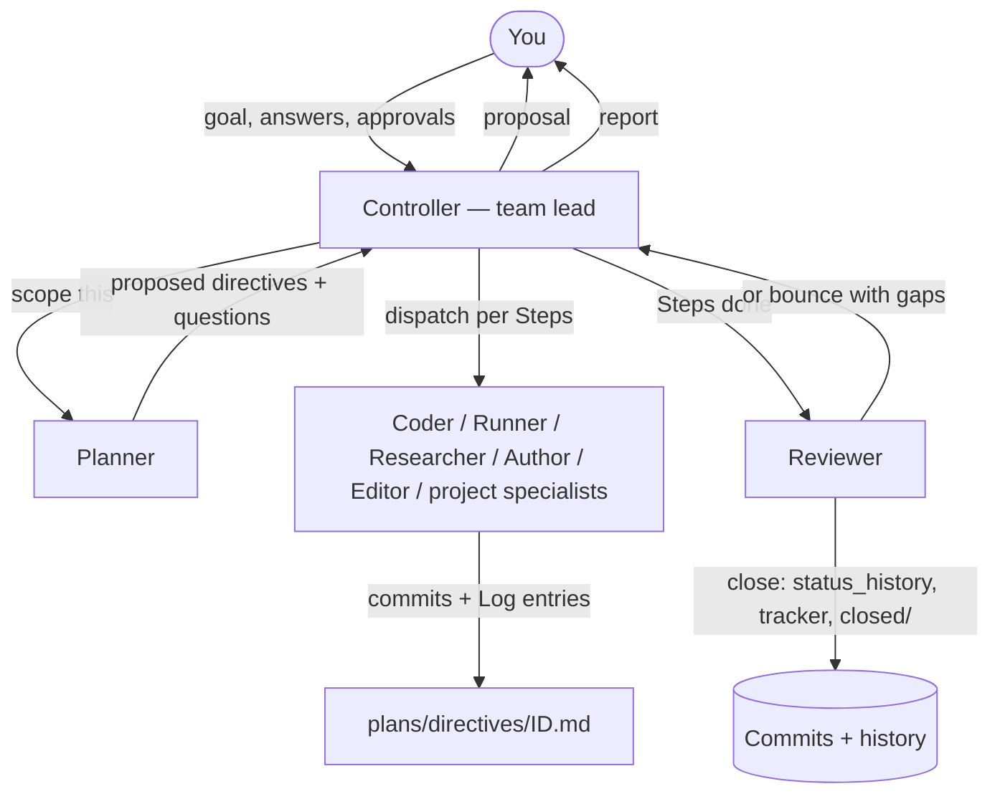

# Multi-Agent Harness — User Guide

The operator guide for a `friday` multi-agent harness. It is the same file
for every project: this repo owns it, and consumer projects symlink it in
(`.friday/active/harness/USER_GUIDE.md` → `.friday/USER_GUIDE.md`), so it
updates the moment friday syncs. Deep reference material lives beside it in
`.friday/reference/` (read in place in the submodule; never copied or
symlinked into a project) — see the [index](#deep-reference) at the bottom.
Because the symlinked copy resolves links from a different directory, the
index gives repo-root paths (`.friday/reference/...`) as well as links.

Project-specific facts (name, working root, results doc, package manager,
tracker, project specialists, repository layout) live in the consumer
project's `AGENTS.md`, never here.

**Setting up or reconfiguring the harness** (package manager, tracker,
Docker, GPU) is a separate flow: point an agent at `.friday/setup/SETUP.md`
and ask it to walk you through. friday's own `README.md` covers first-time
drop-in and pulling updates.

---

## What the harness is

A structured multi-agent workflow for long-running research and engineering
projects. Multiple AI sessions (and models) collaborate across hours or
weeks without losing state, drifting from what you asked for, or
fabricating progress — and you deal with exactly one agent, the
**Controller**.

- **No amnesia or drift**: one file per unit of work (`plans/directives/<ID>.md`: goal, steps, `Verify:` line, running log), a live dashboard (`status.md`), and durable history.
- **No fabricated progress**: every directive has an explicit `Verify:` line, results carry provenance sidecars, and an independent **Reviewer** re-runs the check before anything closes.
- **Attributable work**: each producing role commits its own scoped paths with a `Role: description` first line and `Directive: <ID>` in the body (Rule 12).
- **You are not the router**: the Controller plans with the Planner, brings you proposals, dispatches specialists, and returns only for decisions.
- **Token-lean**: hot-path files have line caps (Rule 8); roles read a rule's detail doc only when its trigger matches their next action.


```mermaid
flowchart TD
    User([You]) -->|goal, answers, approvals| Controller[Controller — team lead]
    Controller -->|"scope this"| Planner[Planner]
    Planner -->|proposed directives + questions| Controller
    Controller -->|proposal| User
    Controller -->|dispatch per Steps| Workers[Coder / Runner / Researcher / Author / Editor / project specialists]
    Workers -->|commits + Log entries| Directive[plans/directives/ID.md]
    Controller -->|Steps done| Reviewer[Reviewer]
    Reviewer -->|close: status_history, tracker, closed/| Record[(Commits + history)]
    Reviewer -->|or bounce with gaps| Controller
    Controller -->|report| User
```

---

## The workflow (lead mode)

You talk to one agent, the Controller. Everything else runs as its subagents.

### Start a session

```bash
cd <project root>   # must be the project root, not a parent directory
claude --agent controller
```

Launching from elsewhere hides the harness agent types and hooks; the
Controller stops and asks you to restart if it detects this.

Or open a normal session and say "you are the controller"; under
Antigravity, invoke the `controller` agent. It must be the **top-level**
session (it asks you questions and spawns subagents, which a subagent
can't). It reads `status.md` and tells you what is open, waiting on you, or
blocked. Then give it a goal in plain words.

### What happens next

1. **Questions.** The Controller asks what it needs; answer briefly.
2. **Proposal.** The Planner writes one or more directives and the Controller shows each: goal, Steps (with the role per step), how it is verified, what is out of scope, and the review level. The file is `.friday/active/harness/plans/directives/<ID>.md` if you would rather read it, or answer open questions inline in it, directly.
3. **You approve** ("approve core-01") or ask for changes. **Nothing runs before this.** If the project mirrors work to an issue tracker, the issue opens now (Rule 13).
4. **Execution.** The Controller dispatches specialists and handles retries and review bounces inside the approved scope. It comes back only for a decision only you can make, a scope change (an amendment: Planner, then you), or a step that keeps failing. **Questions go up** to the Controller, which relays them to you.
5. **Report.** When the Reviewer closes the directive you get a summary with the commit(s).

### Useful things to say

| You want to… | Say |
|---|---|
| See where things stand | "status" |
| Start a separate workstream | "new loop `eval`: …" |
| Change a directive in flight | "amend core-01: …" (back to the Planner, then to you) |
| Stop something | "stop core-02" / "park the eval loop" |
| Get a requirements spec (e.g. for a human teammate) | "have the Architect write a spec for …" |
| Skip planning for something tiny | "just do it: …" (you still approve a one-step directive) |
| Fold a closed milestone into the docs | "have the Author fold core-03 into the results doc" |
| Steer a running Controller | Just reply; it tags your words `User-Feedback:` and relays them binding |

### Several loops

A **loop** is a named workstream with its own goal; directive IDs are
`<loop>-<NN>`. Open another terminal, start another Controller, give it a
different loop — each touches only its own rows in `status.md`. Loops share
one working tree and branch: agents commit only their own paths, and a
single-user resource (a hardware board, a file a GUI holds open) is claimed
in `status.md`'s Claims table first. All agents draw on one usage budget, so
two or three loops is a sensible ceiling; each Controller runs at most 3
role subagents at once (2 if any is high tier).

### Planning is two layers

`plans/goals.md` holds the 3–5 project objectives — a stable reference, not
a gate; a directive names the one it serves (`Serves: 2`) or `Serves: —`.
**The directive is the plan**: no epic list, sprint backlog or suggestions
inbox (upgrading from v0.17 or earlier: see
[updating.md](reference/updating.md)). When work needs a signed, durable
scope (a task for a human teammate, a finalized project), ask for a spec:
the **Architect** writes a ≤ 2-page requirements doc in `docs/specs/`, and
directives cite its requirement IDs. Most work doesn't need one.

### Review scales with risk

The Planner sets the review level. **`quick`** (default): the Reviewer
re-runs `Verify:` and checks the commits. **`full`** (`[heavy]` or `[doc]`
directives): also an independent check of the method, and for prose the
page budget, an Editor pass and a cold-reader check (Rule 16). Closing moves
the directive's row from `status.md` to `status_history.md`, closes its
tracker issue, and moves the file to `plans/directives/closed/`.

---

## Roles and tiers

The authoritative table, including the exact model ID per tier, is
`.friday/active/harness/harness.md`; don't copy model IDs into project docs.

| Role | Owns | Talks to you? |
|------|------|---------------|
| **Controller** | Team lead: clarifies, gets planned, gets your approval, dispatches, iterates, reports. Writes only coordination records. | **Yes — single point of contact** |
| **Planner** | Turns a goal into directive files (`Status: proposed`) with Steps, `Verify:`, tier, review level | Via the Controller |
| **Architect** | Optional ≤ 2-page specs in `docs/specs/` | Via the Controller, or directly (`claude --agent architect`) |
| **Coder** | Source, tests, notebooks, scripts, figures | No |
| **Runner** | Launching and monitoring long jobs the Coder built | No |
| **Researcher** | Literature/methodology memos in `docs/research/`; theory drafting if the LaTeX suite is on | No |
| **Author** | Folding closed milestones into the results doc (and `docs/report/` if enabled) | No |
| **Editor** | Subtractive concision pass on prose (Rule 16); output is deletions only | No |
| **Reviewer** | Re-running `Verify:`, checking commits and artifacts, closing or bouncing | No |
| *Project specialists* | A domain the project adds (e.g. board design) | No |

- **The Controller never does specialist work.** Even a one-line fix is a Coder dispatch, so every change has an owner and a record.
- **Drop roles you don't need.** No literature component, no Researcher; no prose, no Editor.

**Project specialists** are project content, tracked in the project repo and
never overwritten or git-excluded by the harness:

| File (project repo) | What |
|---|---|
| `.friday-project/roles/<role>.md` | Role doc (tier, namespace, constraints, handoff); its presence registers the role |
| `.claude/agents/<role>.md` | Claude Code adapter |
| `.agents/agents/<role>.md`, `<role>-heavy.md` | Antigravity adapters |

Each `init_harness.py` run links the role doc into
`.friday/active/harness/roles/`; the spawn-title and commit-message hooks
discover the same directory. List the role in `AGENTS.md`'s **Project
specialists** row. A worked example (a KiCad board role) is in
`.friday/templates/examples/project_roles/`.

**Tiers.** Every role has a default tier (light/mid/high). A directive's
`[heavy]` tag, set once by the Planner (formal derivation/proof or a major
architecture decision, never "this looks hard"), moves whichever role
executes it to a high-tier model for that directive. `[doc]` marks a prose
deliverable and brings Rule 16 into play. `HIGH_TIER_MODEL_KEYWORDS` in
`harness.config.env` is what the spawn hook checks a `[heavy]` spawn's model
against. Antigravity binds the model to the agent file, so escalation means
invoking `coder-heavy` instead of `coder`; Claude Code overrides the model
per spawn.

---

## Where things live

| Looking for | Path |
|---|---|
| Live dashboard (loops, open directives, claims, jobs) | `.friday/active/harness/status.md` |
| Closed-directive history | `status_history.md`: `.friday/active/harness/` with a tracker, `docs/status_history.md` without (see [state_files.md](reference/state_files.md)) |
| Why each rule exists | `.friday/active/harness/log.md` |
| Open / closed directives | `.friday/active/harness/plans/directives/` and `.../closed/` |
| Objectives; decisions digest | `plans/goals.md`; `plans/history.md` (both under `.friday/active/harness/`) |
| Rules and role docs | `.friday/active/harness/harness.md`, `rules/`, `roles/` |
| Results (single source of truth for numbers) | `AGENTS.md` § Project facts → "Results doc" |
| Specs; research memos | `docs/specs/`; `docs/research/` |
| Project layout and facts | `AGENTS.md` |

> [!WARNING]
> `.friday/active/` is gitignored inside the submodule: `git clean -xfd`
> there destroys all harness state, and `git grep` / plain `rg` can't see it
> (use `rg --no-ignore`). Details: [state_files.md](reference/state_files.md).

---

## Quick reference

| Goal | Prompt |
|------|--------|
| Start working | `claude --agent controller` (or "You are the controller.") then state a goal |
| Approve / amend | `approve core-01` / `amend core-01: …` |
| Status | `status` |
| Interactive spec | `claude --agent architect`, then describe the work |
| Research memo | `You are the researcher agent. Please research <topic> and produce a formal memo in docs/research/.` |
| Fold in a milestone | `You are the author agent. Please fold the <milestone> into docs/RESULTS.md.` |
| Hygiene check (Rule 8) | `python3 .claude/hooks/check_md_hygiene.py` (or `.agents/hooks/...`) |
| Pull harness updates | `./harness.sh sync pull` |
| Docker | `docker compose build`, `up -d`, `attach harness` |

Project-specific prompts and paths (e.g. a LaTeX report directory) belong in
`AGENTS.md`. Literature intake, data handling, steering, direct role
invocation and the bibliography/validation commands:
[inputs.md](reference/inputs.md).

---

## Deep reference

Read these when the task matches; each links back here. Repo-root paths are
valid in any consumer project.

| File | Contents |
|---|---|
| [`.friday/reference/rules.md`](reference/rules.md) | Index of Rules 1–16 and the detail doc behind each; Rules 10/14 vary per project |
| [`.friday/reference/hooks.md`](reference/hooks.md) | The four hooks, which adapters wire them, container-mode `command_guard.py` |
| [`.friday/reference/state_files.md`](reference/state_files.md) | `log.md`, `status_history.md` placement, submodule hazards |
| [`.friday/reference/inputs.md`](reference/inputs.md) | Giving literature, data, guidance; invoking Researcher/Author directly; validation commands |
| [`.friday/reference/updating.md`](reference/updating.md) | `harness.sh sync pull`, v0.17 to v0.18 upgrade, pre-v0.13 migration |
| [`.friday/reference/docker.md`](reference/docker.md) | Docker dev container: install, images, build, enter, GPU, volumes, history |
| [`.friday/reference/troubleshooting.md`](reference/troubleshooting.md) | Symptom/cause table |
